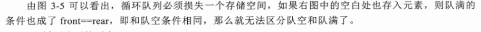

QUEUE

顺序队： 
    在顺序队中，通常让队尾指针rear指向刚进队的元素位置，让队首指针front指向刚出队的元素位置。
    因此元素进队的时候rear要向后移动，元素出队的时候，front也要向后移动。这样经过一系列的出队和进队操作以后，
    两个指针最终就会达到数组末端maxSize-1处，虽然队中已经没有元素，但仍然无法让元素进队，这就是假溢出。
    
解决方法：把数组弄成一个环，让rear和front沿着环走，这样永远不会出现两者来到数组尽头无法继续往下走的情况，这样就产生了循环队列。
    
队空：qu.rear == qu.front

队满：(qu.rear+1)%maxSize ==qu.front

可以防止假溢出

rear指向有数据的节点，front指向有数据的前一个节点。

